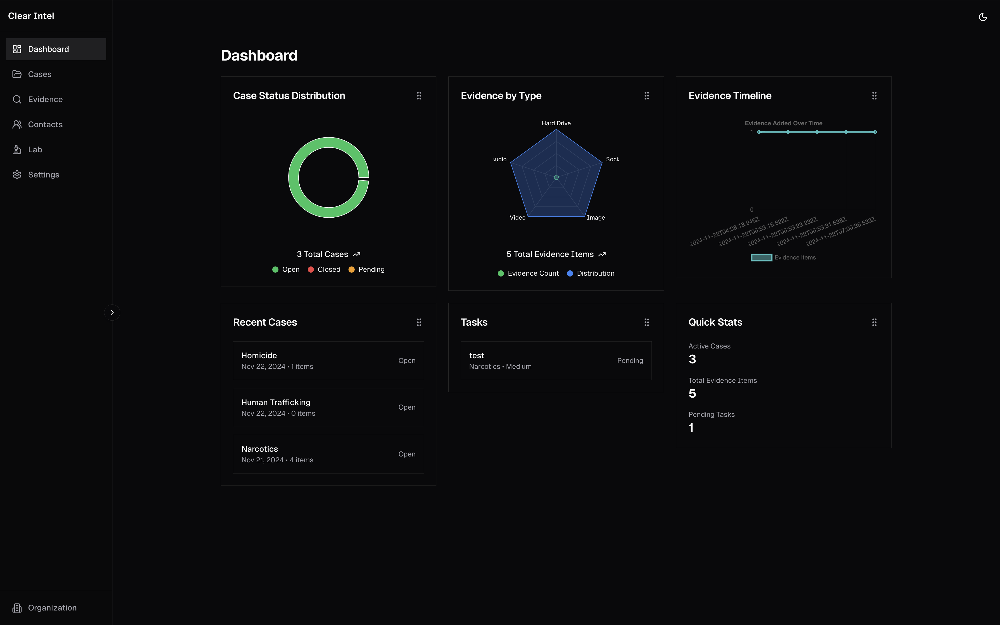
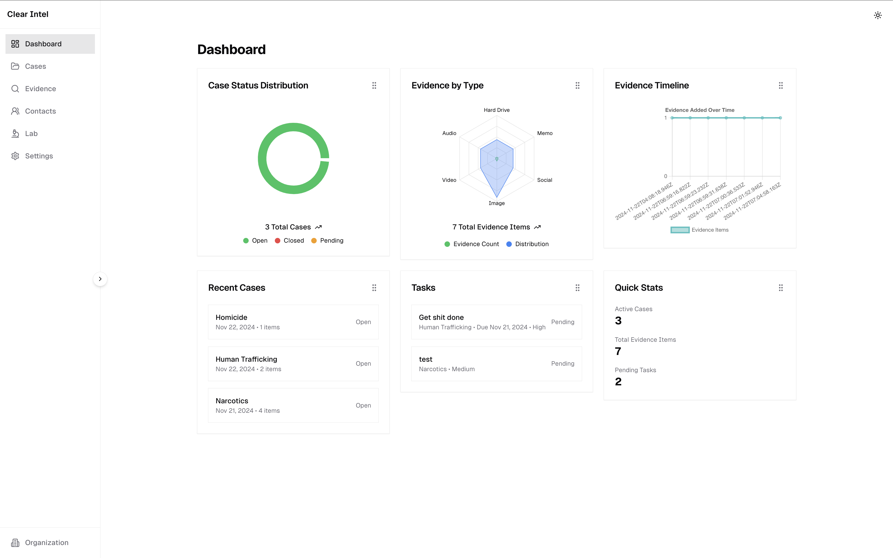
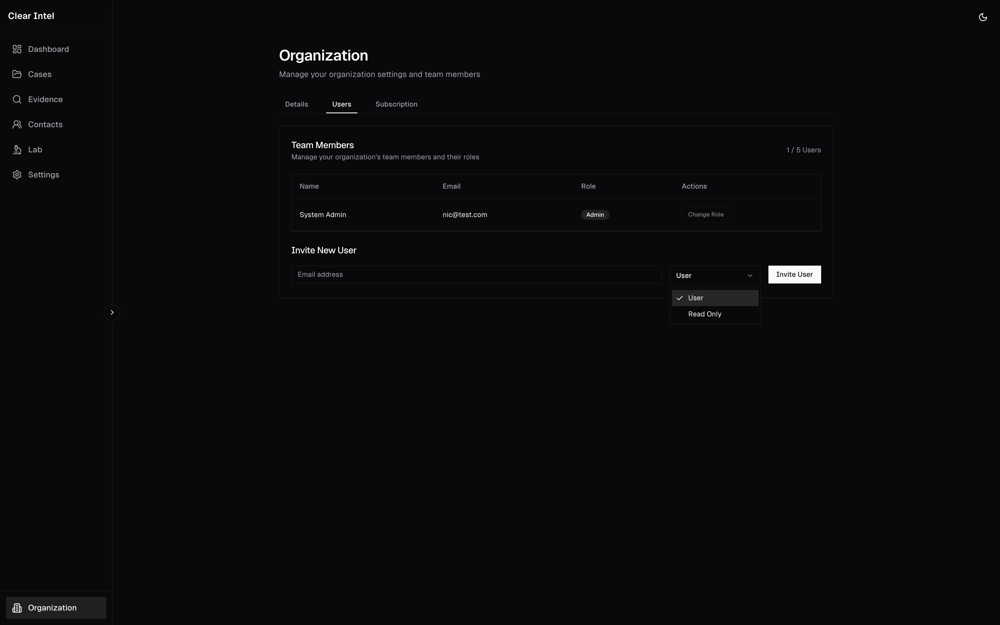
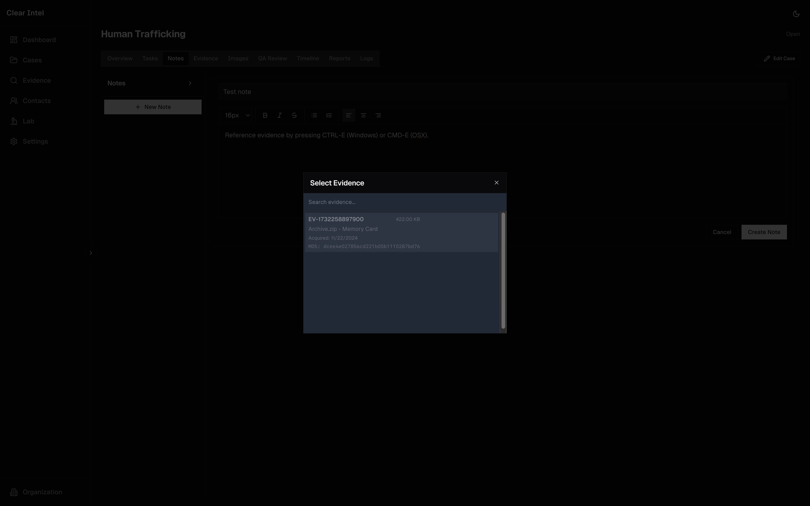
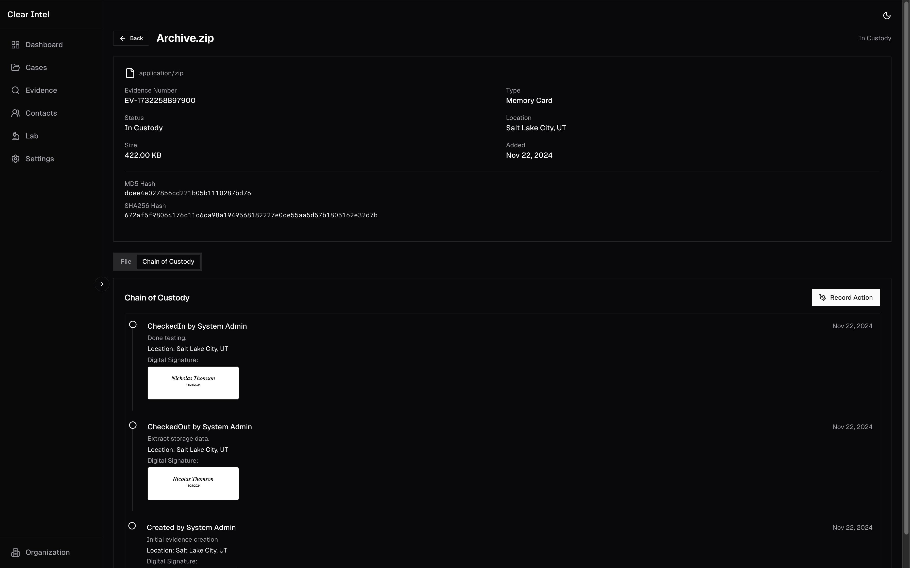
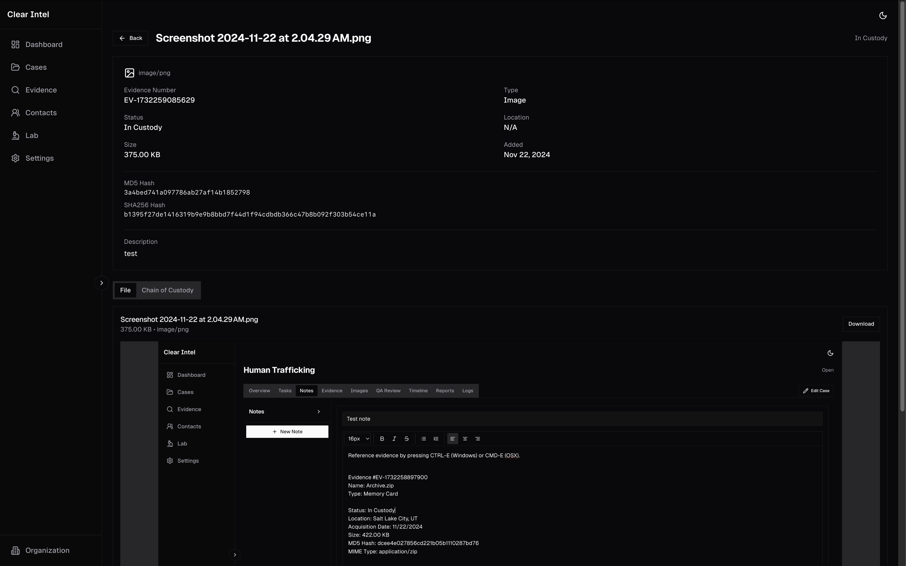

# Clear Intel

A comprehensive digital forensics case management platform designed to streamline investigations, evidence handling, and quality assurance processes.

## Screenshots

### Featured Screenshots

*Case Overview - Comprehensive view of case details and status*


*Case Details - Detailed information and management options*


*Case List - Overview of all cases with filtering and sorting*

### Quality Assurance

*QA Checklist - Comprehensive quality assurance review process*


*QA Template - Customizable templates for consistent reviews*

### Forensic Images

*Forensic Image Management - Track and manage forensic images*

### Reports

*Report Generation - Professional report templates and generation*

> **[View Interactive Screenshot Gallery](docs/gallery.html)** - Explore our complete gallery of features with an interactive viewer that lets you browse through all screenshots with full-size views and easy navigation.

## Core Features

### Case Management
- **Case Organization**
  - Customizable case types and categories
  - Status tracking and priority levels
  - Case linking for related investigations
  - Notes and documentation
  - Audit logging of all case activities
  - Case filters and search

### Evidence Management
- **Digital Evidence Handling**
  - Secure evidence storage with hash verification
  - Evidence categorization and tagging
  - Chain of custody tracking
  - Evidence locations management
  - Custom evidence types
  - Batch evidence processing

### Quality Assurance
- **QA Templates**
  - Organization and user-specific templates
  - Customizable checklists by case type
  - Required steps verification
  - Review tracking
  - Template duplication and sharing
  - Progress monitoring

### Task Management
- **Task System**
  - Task templates for standard procedures
  - Assignment and tracking
  - Due dates and priorities
  - Progress monitoring
  - Time tracking
  - Task dependencies

### Reporting
- **Report Generation**
  - Customizable report templates
  - Evidence inclusion
  - Rich text editing
  - Multiple export formats
  - Automated formatting
  - Batch report generation

### Lab Management
- **Equipment & Software**
  - Equipment tracking
  - Software license management
  - Calibration records
  - Maintenance logs
  - Resource scheduling
  - License expiration alerts

### Analytics & Dashboard
- **Performance Metrics**
  - Case statistics
  - Resource utilization
  - Processing times
  - Examiner metrics
  - Trend analysis
  - Custom dashboards

### Contact Management
- **Contact System**
  - Contact organization
  - Communication tracking
  - Contact roles
  - Organization linking
  - Contact history
  - Quick contact access

### User Management
- **Access Control**
  - Role-based permissions
  - Organization management
  - User activity tracking
  - Session management
  - Multi-factor authentication
  - Access logging

### Image Management
- **Forensic Images**
  - Image acquisition tracking
  - Hash verification
  - Image categorization
  - Storage management
  - Processing status
  - Image analysis tools

### Settings & Configuration
- **System Settings**
  - Evidence type configuration
  - Template management
  - Organization settings
  - User preferences
  - Workflow customization
  - Integration settings

## Technical Features

### Security
- Role-based access control
- Audit logging
- Session management
- Data encryption
- Secure file handling
- Activity monitoring

### UI/UX
- Responsive design
- Dark/light theme
- Rich text editing
- Drag-and-drop interfaces
- Real-time updates
- Interactive dashboards

### Integration
- API endpoints for external tools
- Custom field support
- File system integration
- Report generation hooks
- Authentication system
- Storage system integration

## Setup & Documentation

See [SETUP.md](SETUP.md) for detailed installation instructions and [ADMIN_SETUP.md](ADMIN_SETUP.md) for organization administration guide.

### Prerequisites
- Node.js 18+
- PostgreSQL 14+
- npm or yarn

### Quick Start
```bash
# Clone repository
git clone https://github.com/clearintel/case-management.git

# Install dependencies
npm install

# Configure environment
cp .env.example .env

# Initialize database
npx prisma migrate deploy

# Set up first admin
npm run setup-admin

# Start development server
npm run dev
```

## Technology Stack

- **Frontend**: Next.js 14, React, TypeScript, Tailwind CSS
- **Backend**: Node.js, Prisma ORM
- **Database**: PostgreSQL
- **Authentication**: NextAuth.js
- **UI Components**: shadcn/ui
- **File Handling**: Custom file system integration

## Support

For support inquiries, please contact:
- Email: support@clear-intel.com

## License

Copyright © 2024 Clear Intel. All rights reserved.
